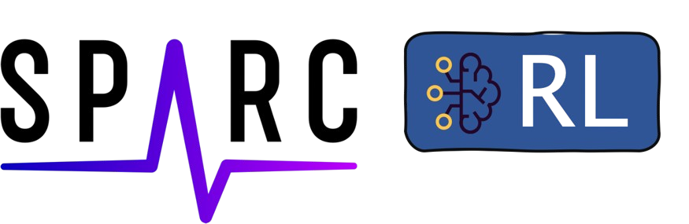
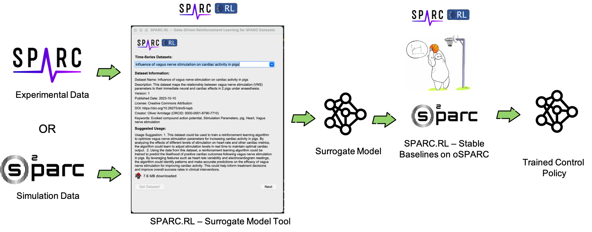
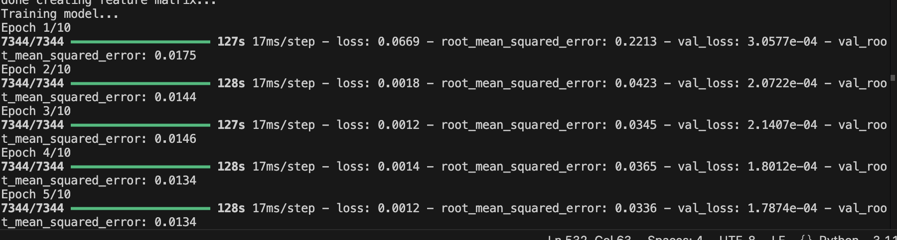
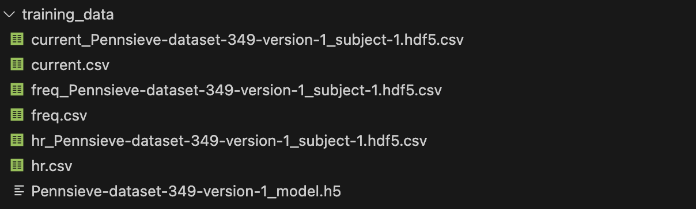
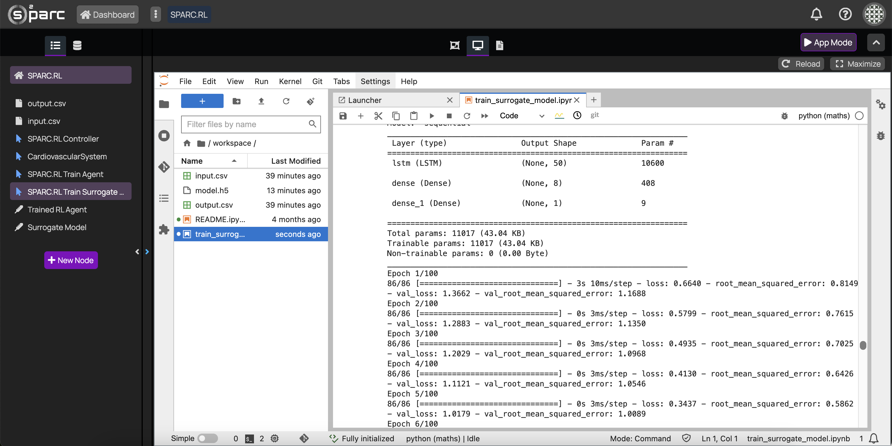
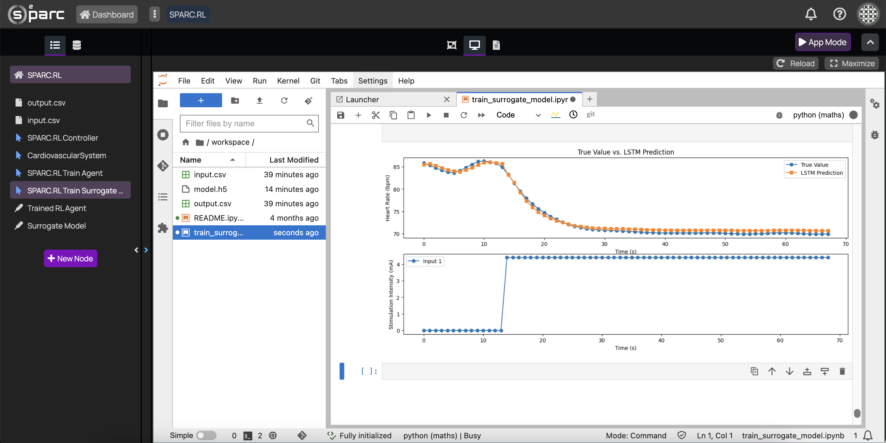
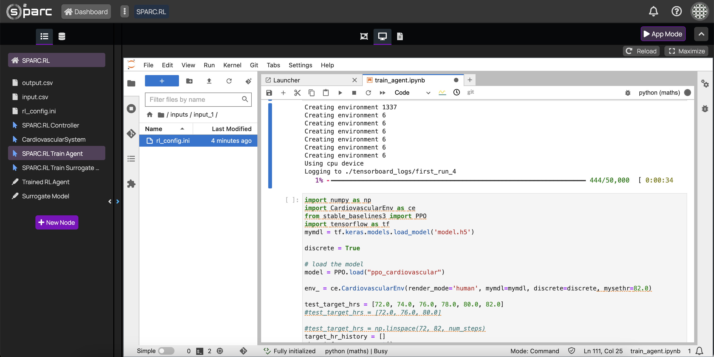
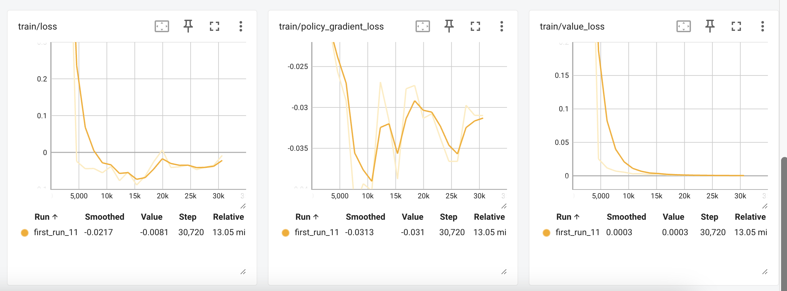
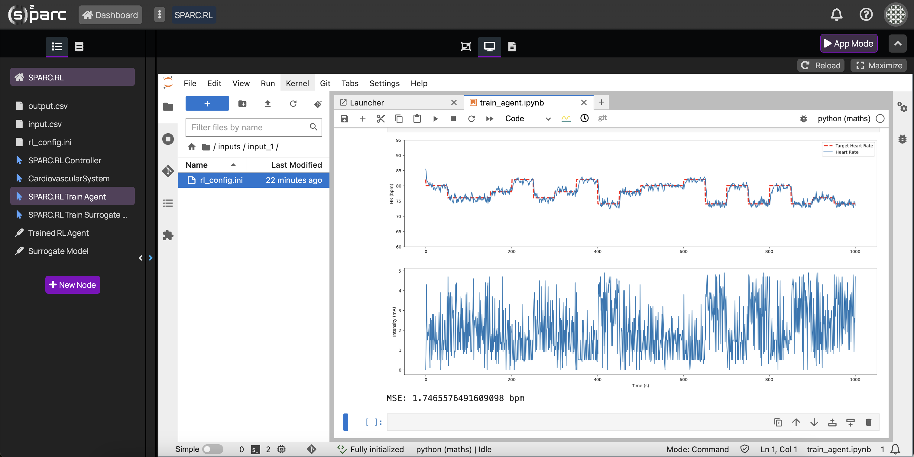

<br/>


# Reinforcement Learning for Medical Device Control Made Easy
The control of medical devices, particularly in applications like neuromodulation, is increasingly focused on the development of closed-loop systems. These systems are gaining attention because they allow for real-time adjustments based on continuous feedback, leading to more precise and personalized treatments. However, developing the adaptive intelligence required for closed-loop control often demands specialized knowledge in sophisticated control theory, e.g. in reinforcement learning, posing a significant barrier for many researchers. SPARC.RL addresses this challenge by offering a proof-of-concept toolchain that simplifies the training of state-of-the-art reinforcement learning agents, even for those without deep expertise in the field. By leveraging the powerful [Stable Baselines 3](https://stable-baselines3.readthedocs.io/) framework and seamlessly integrating data from the SPARC platform with models from oSPARC, SPARC.RL democratizes access to advanced reinforcement learning techniques. This toolchain empowers researchers to explore and implement sophisticated control strategies, accelerating the development of more effective and personalized medical interventions through closed-loop systems.

SPARC.RL is a first proof-of-concept toolchain designed to enable researchers, even those without specific domain knowledge in reinforcement learning, to effortlessly train sophisticated, state-of-the-art reinforcement learning (RL) agents for robust medical device control, by example of closed-loop vagus nerve stimulation for heart rate control. It levarges the power of Sable Baselines 3, one of the most prominent and powerful reinforcement learning frameworks available. SPARC.RL allows users to integrate and utilize data from the [SPARC](https://sparc.science/) platform and models from [oSPARC](https://osparc.io/) seamlessly into a reinforcement learning pipeline running on the oSPARC platform that can be applied to arbitrary control problem in the biomedical field.

This toolchain and oSPARC pipeline were developed during the [2024 SPARC FAIR Codeathon](https://sparc.science/news-and-events/events/2024-sparc-fair-codeathon) by Max Haberbusch and John Bentley.

<b>The framework resulting from this codeathon can be accessed on [oSPARC](https://osparc.io/).</b>

<i>Note: While this project offers powerful capabilities, please note that it is an initial prototype serving as a proof of concept, and no guarantees are made regarding its bug-freeness and operability with other datasets than those used during development.</i>


## Key Features:
The SPARC.RL toolchain consists of a standalone client that is used to obtain and preprocess appropriate datasets for reinforcement learning from the [SPARC](https://sparc.science/) platform and an oSPARC pipeline that allows the development of reinforcement learning-based control algorithms using Stable Baselines 3 (Figure 1). This also involves using a large language model to present suggestions to the user on how to use the selected dataset in reinforcement learning. The standalone client helps to preprocess the data, design a proper neural network architecture, and train the model. The result is trained model that is saved to the hard disk. The second component is a [oSPARC](https://osparc.io/) application enables the use of the Stable Baselines 3 framework harnessing the computational power of oSPARC (Figure 2). Here the user can load the pre-trained surrogate model and parameterize the reinforcement learning policy and training.

<p>
Additionally, SPARC.RL provides a fully integrated reinforcement learning pipeline running on the oSPARC platform that also enables the possibility of training surrogate models for efficient representation of system dynamics (Figure 2).
<p>
  
<br/><br/>

<p align="center">
<br/>
  <b>Figure 1.</b> Overview of the SPARC.RL toolchain.
</p>

<p align="center">
<br/>
  <b>Figure 2.</b> Fully integrated SPARC.RL reinforcement pipeline on oSPARC.
</p>


### Dataset and Model Integration:

SPARC.RL supports the selection and use of time-series datasets directly loaded from the SPARC platform using the [SPARC Python client](https://docs.sparc.science/docs/sparc-python-client).
Users can also work with selected [oSPARC](https://osparc.io/) models, enabling the training of RL agents in a highly flexible and customizable manner.<br/><br/>
<i>Note: During development of our toolchain during the SPARC Codeathon 2024, we used the dataset of Oliver Armitage et al. "Influence of vagus nerve stimulation on vagal and cardiac activity in freely moving pigs" available on sparc (doi: [10.26275/aw2z-a49z](https://doi.org/10.26275/aw2z-a49z)) </i>

#### Customizable Inputs and Outputs:
While the ultimate goal was that users can choose from available model inputs (actions) and model outputs (observables) to tailor the reinforcement learning process to their specific needs, in the current version, this can only be done by modifying the code. Later versions should allow the user to pick appropriate actions and observables directly from the graphical user interface.

### Data-driven Modelling:

SPARC.RL offers multiple deep learning architectures to create surrogate models of experimental data available on [SPARC](https://sparc.science/) or [oSPARC](https://osparc.io) models.
Users can select from various RNNs optimized for time-series modeling, including vanilla recurrent neural networks (RNNs), long short-term memory (LSTM) networks, bi-directional LSTM (BiLSTM) networks, and gated recurrent units (GRUs), providing flexibility in how the models are trained. Users can configure their network and training parameters according to their needs. The adjustable parameters include the number of layers, number of units per layer, optimizer, learning rate, batch size, number of epochs, and early stopping policies.

### Steps to Generate the Surrogate Model

#### Installation 

##### Clone the Repository
```
git clone https://github.com/SPARC-FAIR-Codeathon/2024-team-8.git
cd 2024-team-8/sparcrl_surrogate
```

##### Create and Activate a Conda Environment:
If you don't have Conda installed, you can install Miniconda or Anaconda as they come with Conda included.

Create and activate the environment using the provided `environment.yml` file:
```
conda env create -f environment.yml
conda activate sparcrl
```

##### Run the Surrogate Modeling Tool: 
Now you are all set to run the surrogate modeling tool. To do so run the following command on your command line.
```
python sparcrl_surrogate.py
```

In the first step, select a dataset from the dropdown menu which is automatically populated with available datasets on the SPARC platform. Currently, the datasets are limited to time series data. Once you have selected a model you can inspect the model metadata like model description, creator, creation date, version, etc. Additionally, a large language model is used to generate suggestions on how to use the dataset for reinforcement learning. Once you have chosen your dataset, you can download and extract the data from SPARC by hitting the 'Get Dataset!' button. You will be asked in what folder to save the data. After that, you can proceed to the next step, to select the file(s) to use for training the surrogate model by hitting the 'Next' button.<br/><br/>
<p align="center">
<br/>
  <b>Figure 3.</b> Select dataset from SPARC platform to train surrogate model.
</p><br/>
Once you have chosen and downloaded an appropriate dataset, you can select one of the available files containing experimental data using the dropdown menu. The data is automatically filtered for appropriate file types. Currently, only the .hdf5 file format is supported. After you have selected a file, the data is pre-processed to bring it in a proper format for training the model. You can display the pre-processeed data using by hitting the 'Plot Data!' button. If you are satisfied with the preprocessed data, you can move to the next step by hitting the 'Next' button.<br/><br/>
<p align="center">
<br/>
    <b>Figure 4.</b> Select a file from the dataset for model training and inspect preprocessed data.
</p>
<br/>
After loading the data for training, you can define your model architecture. For now, the tool allows you to use different types of recurrent neural networks including LSTM, Bi-LSTM, GRU and vanilla RNNs. You can adjust the number of layers and units per layer based on the complexity of the dynamics in the data that you are trying to capture. Additionally, you can specify training-related parameters like batch-size, learning rate, optimizer, number of epochs and also early stopping to prevent model overfitting. Once you have defined the parameters you can hit the 'Train!' button to start the training. This will print the final model architecture and start the training. For now, a fixed ratio of 8:1:1 for training, validation, and test datasets is used. Currently, if you want to adjust the ratio, you unfortunately have to dig into the code.<br/><br/>
<i>Note: The status messages about the training are written to the console and not passed on to the graphical user interface for now. If you want to observe the training progress, please check the terminal that you used to start the graphical user interface. Also, during the training, the user interface might get unresponsive. Do not worry, just wait until the training is finished.</i>
<br/><br/>
<p align="center">
<br/>
      <b>Figure 5.</b> Define model architecture and set training parameters.
</p><br/>
Now you can sit back and watch Tensorflow doing its magic to train your surrogate model. The trained surrogate model is saved along with the training data into the `training_data` directory in your project folder.
<br/><br/>
<p align="center">
<br/>
        <b>Figure 6.</b> Observe training progress.
</p>
After the training is completed, you can access the training data (.csv files) and the trained model (.h5 file) that was saved to your hard disk from your project directory. 
<p align="center">
<br/>
        <b>Figure 7.</b> Training data and trained model saved to hard disk.
</p>

### Reinforcement Learning using SPARC.RL on oSPARC:
Training of the surrogate model can also be done on the oSPARC platform, however without the ability to directly select data from the SPARC platform as previously shown in the standalone client. The training can be run using the SPARC.RL Train Surrogate Model node which tries to approximate the relationship of the inputs and outputs of a dynamical system which are passed to the node using csv files (input.csv and output .csv). The SPARC.RL Train Surrogate Model node saves the trained deep neural network to a .h5 file (model.h5). 

The trained surrogate model then serves an input to the SPARC.RL Train Agent node which is used to train the reinforcement learning agent. The output of this node is a .zip file containing the trained reinforcement learning agent (ppo_cardiovascular.zip) which then can be used as a controller.

<p align="center">
<br/>
        <b>Figure 8.</b> Overview of SPARC.RL nodes on oSPARC.
</p>

<p align="center">
<br/>
        <b>Figure 9.</b> Surrogate training on oSPARC using SPARC.RL Train Surrogate Model Node.</p>

<p align="center">
<br/>
        <b>Figure 10.</b> Surrogate model predictions compared to ground truth running in SPARC.RL Train Surrogate Model node on oSPARC.</p>

After training the surrogate model, users can parameterize the RL process by selecting from a range of popular RL algorithms such as A2C, DDPG, DQN, HER, PPO, SAC, and TD3, along with their respective policies. The tool supports detailed customization, including choosing the type of action space (discrete or continuous), specifying value ranges, and setting the number of actions for discrete spaces.
Advanced Training Customization:

##### Paramterize Reinforcement Learning
The SPARC.RL Train Agent node is designed to allow various aspects of the reinforcement learning setup and testing process to be parameterized. Environment settings, such as the choice between discrete or continuous action spaces and the number of parallel environments for training, can be adjusted. The path to the surrogate model and the specific heart rate targets used during testing are also configurable. PPO model parameters, including the policy type, number of training steps, batch size, and total timesteps, can be defined to optimize the training process. Additionally, testing parameters, such as the number of iterations and the interval for changing heart rate targets, can be customized. Finally, the paths for saving and loading trained models are configurable, enabling the script to be flexible and adaptable to different experimental needs.

The reinforcement learning can be adjusted to ones needs by modifying the rl_config.ini file that is used as input to the SPARC.RL Train agent node. As example, the parameters used during the codeathon are printed below:

```
[Environment]
discrete = True
model_path = model.h5
env_id = 1337
parallel_envs = 6
target_hrs = 72.0, 74.0, 76.0, 78.0, 80.0, 82.0

[PPO]
policy = MlpPolicy
n_steps = 256
batch_size = 32
total_timesteps = 50000
tensorboard_log = ./tensorboard_logs/
tb_log_name = first_run

[Testing]
test_iterations = 1000
steps_per_target_change = 50
render_mode = human

[SavedModel]
save_path = ppo_cardiovascular
```

<p align="center">
<br/>
        <b>Figure 11.</b> Running Proximal Policy Optimization (PPO) with the previously trained surrogate model in SPARC.RL Train Agent node on oSPARC.</p>

<p align="center">
<br/>
        <b>Figure 12.</b> Loss for reinforcement learning agent training.</p>


<p align="center">
<br/>
        <b>Figure 13.</b> Testing the trained reinforcement learning agent on the surrogate model in SPARC.RL Train Agent node on oSPARC. Running 1000 seconds of heart rate tracking with random setpoint heart rates with a steady state error quantified by mean squared error between setpoint and measured heart rate of only 1.75 bpm.</p>

## License
This project is distributed under the terms of the [MIT License](./LICENSE).
